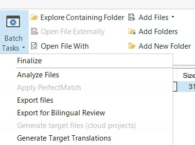
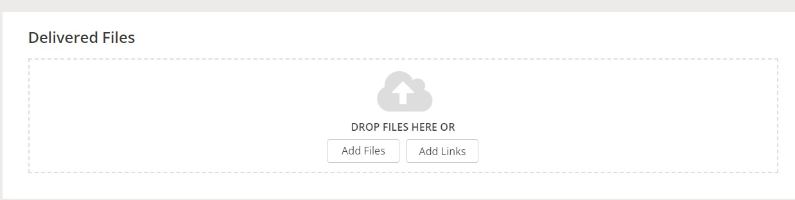

---

title: Post-processing of the translated files
layout: default
nav_order: 6

---
POST-PROCESSING OF THE TRANSLATED FILES
===============
The post-processing of the translated files was already covered in the previous chapters. This chapter aims, however, to provide you with a short overview of this process, with a
special reference to various workflows ordered by the client. 

>In general, please remember to report any doubts early enough so that they can be addressed by our team and to avoid possible delays of the entire process.

**TRANSLATION ONLY**

After you have finished the QA process and other steps already discussed in the respective chapter, please once again make sure that all the files are finished, which is indicated by the 100% score in the progress bar.
The next step is to generate the sdlxliff files. To do so, please open your Trados once again and:
1. Go to your project and open it.
2. Select all the files by clicking the Ctrl-A shortcut. 
3. Click "Batch Tasks"
4. Choose the "Generate Target Translation" option from the dropdown menu.
   
6. All you have to do in the next steps is just clicking the "Next" button. 
7. When the process is finished and no errors are shown, just accept the prompt "Would you like to open the folder containing your exported documents?" by clicking "OK".
8. You will be then directed to the folder with your files. You should find them in the "pl-PL" folder.
9. Select all the files once again and upload them to a newly created folder on the F:/ drive. 
10. Afterwards, please sign in to the XTRF Vendor Portal and click the project name.
11. You can see the project page and the "Delivered Files" section. It is the place where you need to upload your files.
     
13. There is nothing more to do on your side. The project manager of our client will get notified that we are done. Congratulations!

**TRANSLATION+EDITING**

This workflow is a bit easier for you as you are expected to be in charge of the "translation" phase only. In order to forward the files to our editor, please:

1. Go to your project and open it.
2. Select all the files by clicking the Ctrl-A shortcut. 
3. Click "Batch Tasks"
4. Choose the "Generate Target Translation" option from the dropdown menu.
5. All you have to do in the next steps is just clicking the "Next" button. 
6. When the process is finished and no errors are shown, just accept the prompt "Would you like to open the folder containing your exported documents?" by clicking "OK".
7. You will be then directed to the folder with your files. You should find them in the "pl-PL" folder.
8. Select all the files once again and upload them to a newly created folder on the F:/ drive. 
9. Notify your project manager and let them know where the files are located.
10. Make sure you regularly check your inbox for any possible emails from the editor who may ask for some clarifications.

**TRANSLATION+EDITING+PROOFREADING**

Please proceed as already indicated above. 
