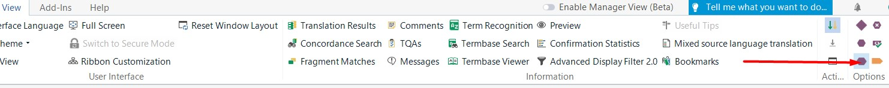
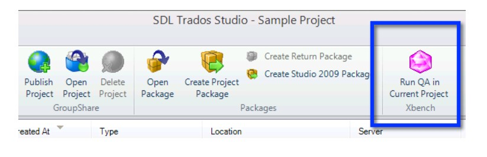

---

title: Self-revision + QA with Xbench
layout: default
nav_order: 5

---

SELF-REVISION
===============

Translating the entire project is not the end of your task. Quite the contrary. As a part of our quality standard policy, you are expected to conduct two additional steps:

1. self-revision of your work
2. QA with Xbench 

**SELF-REVISION OF YOUR WORK**

In simple words, it means carefully reading the entire text, paying special attention to the following aspects:

**Spelling**

This is the most crucial part of the self-revision task, which can be, luckily, done quite automatically. You just need to press the F7 button and carefully examine all the instances shown.

> Caution! Please bear in mind that not all the "mistakes" indicated by Trados spellcheck should be corrected. Even though this function relies on some modern solutions, including Hunspell, they
are not perfect enough to be fully trusted. Your discretion and common sense will be very much appreciated.

This part of the task can be also performed with Xbench. Please see the instructions below for further clarifications.

**Consistency**

Don't forget that one source term should have in most cases only **ONE** equivalent in the target. This is especially important for the reader who needs to follow certain procedures promptly, 
without getting confused about ambiguities

**Style**

As already indicated in the previous chapters, you will work with several different files that have their own specific requirements in terms of style. Before starting your self-revision, please reach out to the [File types - what can you expect](File_types - what_can_you_expect.md)
chapter. 

**Tags**

The last element you need to consider are purple text elements called tags. Handling tags is essential for preserving the formatting and structure of the original document. Have a look at this short overview
of things to keep in mind:

1) Please make sure you have enabled the full tag view. To do so, please:

- Go to the "View" tab on the ribbon menu at the top of the Trados Studio window.

- Within the "View" tab, locate the "Options" group.

- Now select "Full Tag Text". This lets you see the whole tags.

:information_source:

In general, the tags used in target should very precisely mirror the ones used in source. Familiarize yourself with the sentence structure in the source and check if the corresponding words were put at the same places in target.
When in doubt about the word/object represented by a tag, please make sure to consult the PDF reference provided and/or approach the client's project manager.

The easiest way to verify if the tags were placed correctly is to run the QA with xBench. This is going to be explained a bit further on.

QA WITH XBENCH
===============

Even the best, most careful translator can omit some crucial mistakes that appear in their own text. Consequently, it is recommended to conduct an additional, automatic quality assurance process with a third-party tool called
Xbench. 
In order to start using it, simply press the purple gem icon in Trados. 

Credits for the image: https://docs.xbench.net/plugin-studio/using-the-plugin/

Even though this highly advanced tool offers a wide range of options to choose from, it is sufficient to confine to the most basic ones. 
Before you start performing an xBench QA of your first translated text, have a look at the software interface and the quick summary as outlined in the table below:

| Category                                 | Description                                                                                           |
|------------------------------------------|-------------------------------------------------------------------------------------------------------|
| Untranslated Segments                    | Segments that have not been translated.                                                               |
| Same Source Text, Different Target Text  | Segments with the same source text but different target text.                                          |
| Same Target Text, Different Source Text  | Segments with the same target text but different source text.                                          |
| Identical Source and Target Text         | Segments whose target text is identical to the source text (potentially untranslated text).           |
| Tag Mismatches                           | Segments with inconsistencies or mismatches in tag usage.                                               |
| Number Mismatches                        | Segments with inconsistencies in numeric values between source and target texts.                       |
| URL Mismatches                           | Segments with inconsistencies or mismatches in URLs.                                                    |
| Alphanumeric Mismatches                  | Segments with inconsistencies or mismatches in alphanumeric characters.                                |
| Unpaired Symbols                         | Segments with unpaired symbols such as parentheses, square brackets, or braces.                        |
| Unpaired Quotes                          | Segments with unpaired quotation marks.                                                               |
| Repeated Words                           | Segments containing repeated words.                                                                    |
| Double Blanks                            | Segments containing consecutive blank spaces.                                                         |
| Deviation from Key Terms                 | Segments that deviate from the key terms of the project.                                               |
| CamelCase Words                          | Segments containing words in CamelCase format without a counterpart.                                    |
| Uppercase Words                          | Segments containing words fully in uppercase without a counterpart.                                     |
| Checklists Criteria                      | Segments that meet the search criteria of entries in the project or personal checklists.               |
| Spell-checking Issues                    | Segments with spelling errors identified during spell-checking.                                         |

>Before you start performing a QA, please make sure that you have checked the "Exclude locked segments" option. It is irrelevant to our project, as we are not able to unclock the files manually on our side.

Not that you know the certain categories and their meaning, you are ready to start your QA process.

To do so, simply press the "QA" button in the upper toolbar and then proceed to "Check Ongoing Translation". 

As a result you will get a report outlining the error categories prepared on the basis of your output. Each of them contains the segments in which those issues occurred, accompanied by their number. Here's how to proceed to maximize
the chance of spotting (and correcting) all errors:

**Review Issues:** Go through the issues identified in the report one by one. Even though the segment may seem OK at first glance, double-check it.

**Fix Issues in Translation Tool:** If you find any issues in the translation, you should go back to Trados and make the necessary corrections. Remember to confirm the segments again after editing them!

**Re-run QA Check (Optional):** After making corrections, you can re-run the QA check in Xbench to ensure that the issues have been addressed.

**Save or Export Report:** Once you're satisfied with the corrections, please save or export the Xbench report. Our client might ask for it. 

